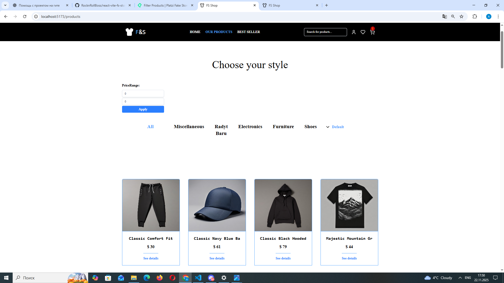
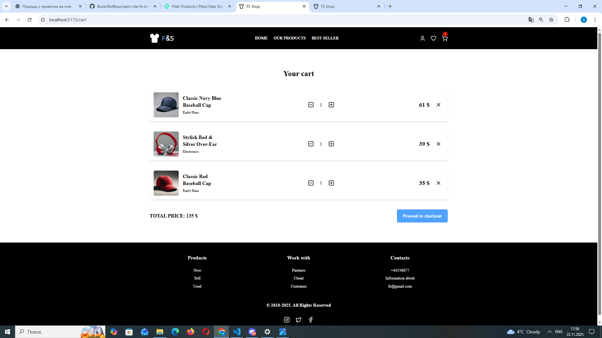
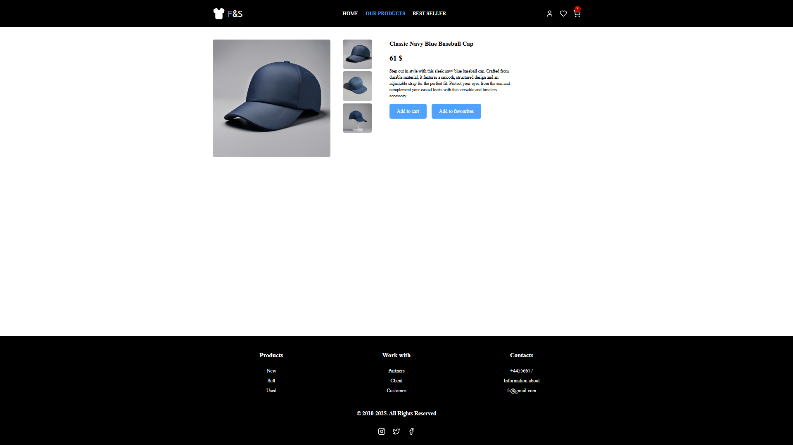

# FS Shop

## 🚀 About the Project

FS Shop is a demo e-commerce store. Built with React + TypeScript, using Vite, Zustand, TailwindCSS, and React Router. Data is fetched from the public API: [http://fakeapi.platzi.com/](http://fakeapi.platzi.com/).

The shop includes a product catalog, filtering, search, sorting, cart functionality, product details page, and authentication.

## ✨ Key Features

* 🔍 Product search by name
* 🏷️ Category filtering
* 💲 Price range filter (from–to)
* ⚙️ Price sorting (ascending/descending)
* 🛒 Shopping cart:

  * quantity update
  * remove products
  * automatic total price calculation
* 🔐 Authentication / JWT
* 📄 Product details page
* ⚡ Zustand store (cart, filters, auth)
* ⚡ Custom hooks (use-filters, use-toggle-sort, etc.)
* 🌐 Axios for API requests
* 🎨 TailwindCSS styling
* 📱 Fully responsive design

## 🧩 Technologies Used

* React + Vite
* TypeScript
* Zustand
* Axios
* React Router DOM
* TailwindCSS

## 📁 Project Structure

```
components/
constants/
enums/
hooks/
pages/
services/
store/
utils/
public/screenshots/  # screenshots for README
```

## ▶️ Running the Project

```bash
npm install
npm run dev
```

For production build:

```bash
npm run build
```

## 🌍 Deployment

The project is deployed on Vercel: [FS Shop Live](https://react-vite-fs-store.vercel.app/)

## 📸 Screenshots






```

